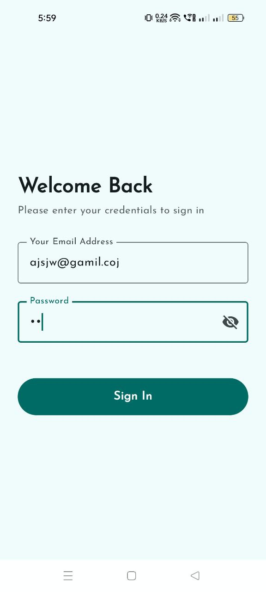
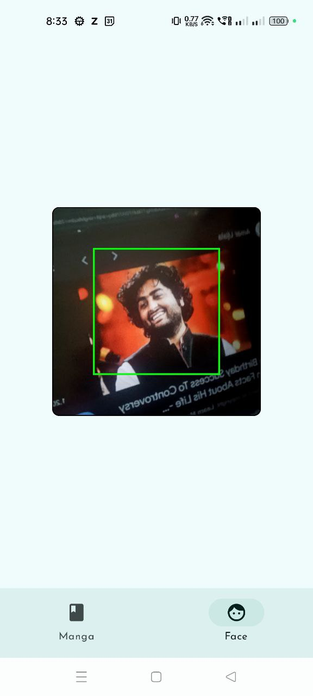

# 📚 Manga Vision

**Manga Vision** is a modern Android app to explore manga with **offline access**, **paginated content**, and **face recognition unlocking**. Built using **Jetpack Compose**, **Room**, **Paging 3**, and **MediaPipe** – all following Google's **Clean Architecture** guidelines.

---

## 📦 Download

▶️ [Download Debug APK](https://drive.google.com/file/d/1hiRwhs_oCxvZbWGu1niXG9DvkHVjytQC/view?usp=sharing)

---

## 🎥 Demo Video

---

## 🎯 App Functionality

### 🔐 Authentication Screen  
- Secure RoomDB-based local login  
- Offline-first user management  

### 📖 Manga Screen (Home)  
- Paginated manga list via **Paging 3**  
- Works **offline** (page 1 data + images cached)  
- Displays thumbnail, title, status, and chapters  

### 👤 Face Detection Screen  
- Uses **front camera** with **MediaPipe** for live face tracking  
- Green box when face detected inside target area  
- Integrated into bottom navigation  

### 📄 Manga Detail Screen  
- Shows full summary, image, and metadata  
- Opens from the home screen on tap  

---

## 🚀 Features

- ✅ Offline-ready with Room DB and image pre-caching
- 📶 Auto-sync when network is back
- 🔐 RoomDB local authentication
- 🔁 Pagination with **Paging 3**
- 📷 Face detection via **MediaPipe + CameraX**
- 💡 Built with **Jetpack Compose + Hilt DI**
- 🧱 Scalable **MVVM Clean Architecture**

---

## 🧰 Tech Stack

- **UI:** Jetpack Compose, Material 3  
- **DB & Storage:** Room (first-page cache)  
- **Networking:** Retrofit, Gson, Coroutines  
- **Pagination:** Paging 3 (local + remote source)  
- **AI/Camera:** CameraX + MediaPipe (Face Detection)  
- **Image Handling:** Coil (with custom caching)  
- **Architecture:** MVVM + Clean Architecture  
- **DI:** Hilt

---

## 🧑‍💻 Author

**Ashim Khan** – Android Developer  
